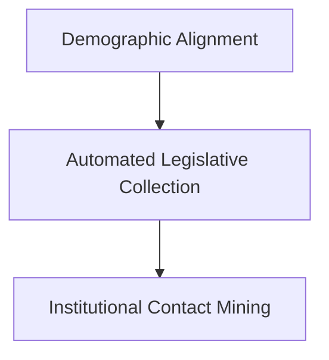

# Legislative Collection

Pipeline de engenharia de dados responsável pela descoberta, coleta, validação e consolidação das Leis Orgânicas Municipais utilizadas no Trabalho de Conclusão de Curso (TCC).

---

## Contexto do Projeto

Este módulo integra o projeto de pesquisa voltado à análise de similaridade semântica em dispositivos normativos municipais relacionados a quóruns legislativos.

A etapa de coleta foi desenvolvida para lidar com um dos principais desafios do projeto: a elevada heterogeneidade tecnológica dos portais públicos municipais brasileiros.

Durante o desenvolvimento, observou-se que:

* muitos municípios utilizam sistemas legados;
* diversos portais dependem de carregamento dinâmico via JavaScript;
* estruturas de navegação variam significativamente entre municípios;
* alguns portais utilizam iframes, redirecionamentos e mecanismos de restrição automatizada;
* parte dos documentos está disponível apenas em formatos não estruturados.

Dessa forma, a arquitetura evoluiu para uma pipeline híbrida de coleta automatizada e comunicação institucional.

---

# Pipeline Architecture

O fluxo de coleta foi estruturado em três grandes etapas:



---

#  1 — Demographic Alignment

Responsável pela definição da amostra demográfica do projeto utilizando dados oficiais do IBGE.

## Scripts

### `ibge_demographic_collector.py`

Realiza:

* consulta à API SIDRA/IBGE;
* seleção dos municípios da amostra;
* padronização dos nomes municipais;
* geração de slugs para uso posterior na descoberta automatizada de domínios.

---

#  2 — Automated Legislative Collection

Etapa responsável pela tentativa de descoberta e coleta automatizada das legislações municipais, incluindo os mecanismos de auditoria e validação do primeiro lote de arquivos obtidos.

A arquitetura desta fase evoluiu progressivamente de abordagens baseadas em requisições simples para estratégias híbridas de navegação dinâmica e inspeção documental.

## Scripts

### `legislative_document_downloader.py`

Responsável por:

* localizar possíveis links para legislações municipais;
* estruturar os endereços identificados;
* organizar os documentos encontrados para posterior auditoria.

---

### `dynamic_legislative_scraper.py`

Motor avançado de navegação automatizada utilizado para lidar com:

* menus dinâmicos;
* iframes;
* carregamento assíncrono;
* navegação recursiva;
* estruturas complexas de portais legislativos.

Inclui estratégias complementares de:

* exploração profunda de páginas;
* detecção de documentos legislativos;
* extração de links institucionais relevantes.

---

### `legislative_collection_audit.py`

Executa a auditoria técnica dos arquivos coletados automaticamente.

O processo realiza:

* extração textual dos documentos obtidos;
* detecção de páginas inválidas;
* identificação de bloqueios, logins e erros de navegação;
* validação preliminar da integridade documental.

Os resultados desta etapa forneceram o diagnóstico metodológico que demonstrou a baixa confiabilidade da coleta totalmente automatizada em parte significativa dos municípios.

---

### `law_quality_scoring_engine.py`

Mecanismo de inspeção e corte analítico responsável por processar o resultado final da coleta automatizada.

O motor executa:

* filtragem dos documentos textualmente válidos;
* identificação de arquivos incompletos;
* classificação heurística baseada em score documental;
* separação dos municípios aptos para análise automática.

Além disso, o script gera o arquivo de transição `cidades_para_mineracao.csv`, utilizado como insumo obrigatório da próxima etapa da pipeline.

Este componente representa o encerramento da coleta automatizada e a transição metodológica para a coleta institucional assistida.

---

#  3 — Institutional Contact Mining

Etapa de contingência ativada exclusivamente para os municípios que não atingiram os critérios mínimos de integridade documental definidos pelo `law_quality_scoring_engine.py`.

Essa fase foi desenvolvida para complementar a base legislativa por meio de comunicação institucional automatizada.

## Scripts

### `institutional_email_collector.py`

Executa:

* mineração automatizada de contatos institucionais;
* identificação de páginas de contato;
* extração de e-mails utilizando Regex;
* filtragem de padrões inválidos ou ruídos de código.

---

### `institutional_request_dispatcher.py`

Responsável pelo:

* envio automatizado de solicitações institucionais;
* comunicação via SMTP;
* rastreamento de confirmações de leitura;
* personalização das mensagens por município.

---

# Technologies

A infraestrutura computacional utilizada neste módulo foi definida de acordo com as necessidades metodológicas da coleta automatizada, validação documental e mineração de dados legislativos descritas no projeto.

## Core Technologies

* **Python** — Linguagem base utilizada para o desenvolvimento e integração de toda a pipeline de coleta e processamento.
* **Pandas** — Estruturação, transformação, higienização e consolidação das bases de dados utilizadas durante a pesquisa.
* **Requests** — Realização de requisições HTTP para comunicação com APIs públicas e acesso automatizado a portais institucionais.
* **BeautifulSoup4** — Extração e interpretação estrutural de conteúdo HTML em processos de raspagem de dados.
* **Selenium** — Automação de navegadores e simulação de interações humanas em portais com conteúdo dinâmico.

---

## Support Modules and Technical Infrastructure

Além das bibliotecas centrais, o pipeline integra módulos auxiliares responsáveis por tarefas operacionais e validações complementares:

* **Regex (`re`)** — Utilizado para reconhecimento de padrões textuais, mineração de e-mails institucionais e identificação de termos legislativos relevantes.
* **SMTP (`smtplib`)** — Implementação do envio automatizado de comunicações institucionais durante a etapa de coleta assistida.
* **Gestão de Arquivos e Documentos (`os`, `shutil`, `pdfplumber`)** — Manipulação automatizada de diretórios, organização de arquivos locais e extração de texto bruto para o motor de auditoria de score.
* **TQDM** — Monitoramento visual e exibição de barras de progresso durante execuções extensas de coleta e processamento no terminal.
* **Time (`time`)** — Controle de intervalos (delays) entre requisições e navegação automatizada, respeitando as políticas dos servidores públicos acessados.
* **WebDriver Manager** — Provisionamento e atualização automatizada dos drivers de execução utilizados nos processos de automação via navegador (Selenium).

---

# Methodological Notes

A coleta automatizada de legislações municipais apresentou limitações relevantes devido à ausência de padronização entre os portais públicos.

Os resultados das auditorias demonstraram que abordagens exclusivamente baseadas em requisições diretas apresentavam baixa confiabilidade em diversos municípios, exigindo:

* navegação automatizada avançada;
* manipulação de conteúdos dinâmicos;
* comunicação institucional complementar;
* mecanismos adicionais de validação documental.

Essa heterogeneidade tecnológica tornou a coleta de dados uma etapa central da pesquisa.

---

# Repository Structure

```text
Legislative Collection/
│
├── README.md
│
├── ibge_demographic_collector.py
│
├── legislative_domain_scanner.py
├── legislative_document_downloader.py
├── advanced_legislative_scraper.py
├── legislative_collection_audit.py
├── law_quality_scoring_engine.py
│
├── institutional_email_collector.py
└── institutional_request_dispatcher.py
```
