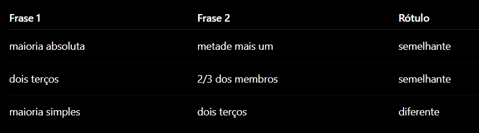

# TCC530-Turma006-Grupo001
---
## Repositório para nosso TCC.
---
### Testes de Hipótese:
#### Cidades vizinhas tendem a ter leis mais similares? 
#### Cidades com populações parecidas adotam quóruns mais rígidos? 
---
### Título possível:
#### Análise de Similaridade Semântica em Dispositivos Normativos sobre Quórum de Votação
---
### Resumo da evolução das representações vetoriais de texto por meio de PLN
---
A evolução das representações vetoriais de texto no Processamento de Linguagem Natural (PLN) iniciou-se com métodos ingênuos, como IDs únicos, one-hot vectors e o modelo Bag-of-Words. Embora funcionais para contagem de frequências, essas abordagens falhavam ao ignorar a ordem sintática, o contexto semântico e a relação intrínseca entre os termos, resultando em representações esparsas e desprovidas de significado relacional. Essa limitação impulsionou o desenvolvimento da Hipótese Distribucional, que postula que o significado de uma palavra é definido pelo seu contexto, permitindo que modelos como Word2Vec aprendessem embeddings densos onde palavras semanticamente similares ocupam posições próximas em um espaço vetorial contínuo.
---
O avanço subsequente superou a estaticidade dos modelos iniciais com a introdução de arquiteturas baseadas em Transformers. Diferente do Word2Vec, que atribuía um único vetor estático por palavra, os modelos contemporâneos, como BERT e GPT, utilizam embeddings contextuais que geram representações dinâmicas conforme o uso do termo na sentença. Essa capacidade de disambiguação polissêmica on-the-fly transformou o paradigma do PLN, conferindo aos sistemas de IA uma compreensão muito mais sofisticada e flexível das nuances da linguagem humana em comparação às técnicas predecessoras.
---
### Metodologia
---
#### Utilizar 3 Embeddings para comparar as leis
#### Um power bi que mostra a comparação semântica das leis (quoruns) em 3 embeddings diferentes
#### Embedding Layer (alimentar o modelo com textos para melhorar a precisão e ajustar melhor os pesos)
#### Transcrever as explicações sobre embeddings antigas que esse vídeo dá, para mostrar como chegamos na conclusão de utilizar os modelos mais recentes: https://www.youtube.com/watch?v=yVZTtnSkya8
#### Melhorias: Criar uma Embedding própria para uma análise ainda mais fiel
---
### Método Inicial de Validação
---

---
## Integrantes
#### Anderson
#### Daniel
#### Fabio
#### Juliana
#### Katriny
#### Mateus
#### Nathalia 
#### Renan